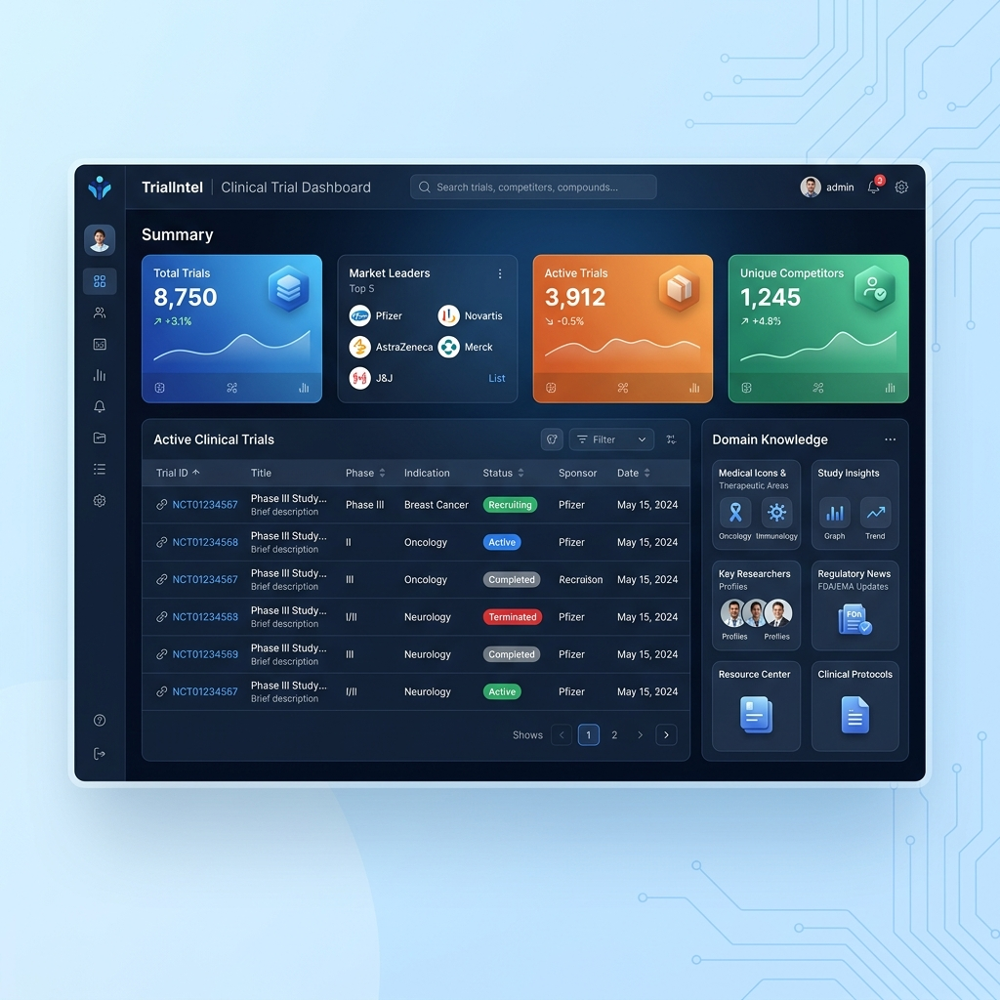

# 🧬 TrialIntel | Clinical Trial Competitor Tracker

> **Transforming raw ClinicalTrials.gov data into actionable competitive intelligence for life sciences leaders.**

[](https://reactjs.org/)
[](https://vitejs.dev/)
[](https://tailwindcss.com/)
[](https://opensource.org/licenses/MIT)



### 🔗 [Live Demo](https://domainschool.github.io/Clinical-Trial-Competitor-Tracker-Builder/)

---

## 🏢 The Business Problem

In the high-stakes world of pharmaceutical and biotech R&D, **data fog** is a silent margin killer. While regulatory data is public, it is often:

*   **Overwhelmingly Dense:** Thousands of trials hidden behind complex, nested JSON structures.
*   **Slow to Parse:** Executives and researchers spend hours manually cleaning data instead of analyzing it.
*   **Lacking Context:** A trial ID (NCT#) means nothing without understanding its impact on market timing and sponsor concentration.

**TrialIntel** bridges this gap, turning the "Data Fog" of ClinicalTrials.gov into a high-fidelity intelligence dashboard that enables faster, data-driven decisions.

---

## 🚀 Core Features

*   **🔍 Smart API Querying:** Automatically filters for **Phase 3** and **Recruiting** trials—the most critical competitive threats—using advanced ClinicalTrials.gov API v2 search tags.
*   **📊 Real-Time Analytics:** Instant calculation of **Market Leader** status and **Competitor Concentration** using high-impact summary cards.
*   **⚡ High-Performance Data Grid:** A sortable, responsive trial table built with the "Clinical Blue" design system for enterprise-grade data density.
*   **🧠 Intelligence Hub:** A built-in "Domain Knowledge" repository (Bento-style layout) that educates stakeholders on clinical trial phases and regulatory milestones.

### 🔬 Domain Logic
The application goes beyond simple data fetching by implementing industry-specific rules:
*   **Sponsor Aggregation:** Scans real-time datasets to identify the "Market Leader" based on active Phase 3 trial counts.
*   **Priority Filtering:** Defaults to Phase 3 trials because they represent the most immediate "Go-to-Market" threats for competitors.
*   **Data Normalization:** Flattens deeply nested protocol sections into developer-friendly objects for zero-latency UI rendering.

---

## 🛠 Tech Stack & Architecture

### The Stack
*   **Framework:** React 18+ (Vite)
*   **Styling:** Tailwind CSS v4 (Modern Design Tokens)
*   **Icons:** Lucide-React (Clinical & Scientific Set)
*   **API:** ClinicalTrials.gov API v2

### How it Works
The application follows a **Fetch → Transform → Visualize** pipeline:
1.  **State Logic:** A custom `useTrials` hook manages the lifecycle of the data, providing a single source of truth.
2.  **Transformation Layer:** A dedicated service layer flattens the complex API response into a clean, flat object structure.
3.  **UI Layer:** Components use `useMemo` for heavy calculations (like top sponsor detection) to ensure 60fps performance even with large datasets.

---

## 🏁 Getting Started

### Prerequisites
*   **Node.js** (Latest LTS)
*   **pnpm** (Recommended package manager)

### Installation
1.  **Clone the repository:**
    ```bash
    git clone https://github.com/domainschool/Clinical-Trial-Competitor-Tracker-Builder.git
    cd Clinical-Trial-Competitor-Tracker-Builder
    ```

2.  **Install dependencies:**
    ```bash
    pnpm install
    ```

3.  **Run Development Server:**
    ```bash
    pnpm dev
    ```

### Environment Variables
No API keys are required for the standard ClinicalTrials.gov public API. If you wish to extend this with private data sources, copy the example:
```bash
cp .env.example .env
```

---

## 🗺 Future Roadmap
- [ ] **AI-Powered Forecasting:** Use historical trial data to predict Primary Completion Date shifts.
- [ ] **Automated Alerts:** Slack/Email notifications when a competitor trial status changes to "Terminated" or "Completed."
- [ ] **Global Mapping:** Map trial sites geographically to identify regional recruitment hotspots.

---

## 🎓 Built with the Domain School Framework

**This project was developed as part of a mission to bridge the gap between technical execution and industry domain knowledge. We build software that solves real-world business problems.**

At Domain School, we believe that the best engineers are the ones who understand the business context of their code.

👉 **[Follow Domain School](https://github.com/domainschool)** for more hands-on, industry-aligned projects.
